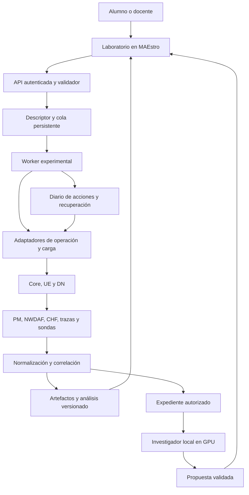

# MAEstro: plan de implementación del Laboratorio de Investigación 5G

Fecha de actualización: 30 de septiembre de 2026. Versión: 1.3.

Estado vigente — entrega 05: piloto operativo vivo admitido mediante asignación
real, preflight de sesiones/cuotas, diario y propiedad remota del transporte.
Recargas CHF auditadas y campaña OFF/ON completa desde el worker, con recepción
y MOS P.1203 conservados. Dos intentos fallidos mantienen su evidencia y
recuperación operativa verificada. La campaña final terminó `completed` con
validez `inconclusive`; la admisión del piloto no acredita recuperación de políticas
SMF/UPF ni exclusión de todos los escritores. G2/G4 siguen abiertos hasta cumplir
esas condiciones y la práctica completa. GPU sin utilizar.
Véanse [entrega 06](laboratory/ENTREGA_06_INVESTIGADOR_LOCAL_RTX5070.md),
[entrega 05](laboratory/ENTREGA_05_CIERRE_GATE_G4_REAL.md),
[plan UDM C idempotencia](../PLAN_UDM_IDEMPOTENCIA_SDM.md) y
[diccionario de medidas](laboratory/DICCIONARIO_MEDICIONES.md). Este estado
prevalece sobre los resúmenes históricos de las entregas anteriores.

Actualización de comisionamiento (30 septiembre UTC / 29 septiembre Lima): el UE competidor 004 ya tiene sesión Internet activa y verificada. `worker --check-real` recopila sesiones, cuota y modo PCF en un expediente de preparación; no consume la cola ni habilita actuación. La lectura MML devuelve modo global, sin checkpoint por sesión ni inflight. RealCoreAdapter actuante, recuperación de políticas y campaña desde el worker siguen pendientes; G2/G4 permanecen abiertos. Véase [entrega 03 y rutas de evidencia](laboratory/ENTREGA_03_COMISIONAMIENTO_REAL.md). Esta actualización prevalece sobre las descripciones anteriores del preflight como exclusivamente simulado.

Estado: diseño y planificación implementados; segunda entrega con asignaciones, motor persistente, interfaz de ejecución y recuperación verificadas exclusivamente en `dry_run` sobre SQLite. Ejecución y recuperación reales del Core, evidencia científica y GPU pendientes. Véanse [entrega 01](laboratory/ENTREGA_01_DISENO_Y_PLANIFICACION.md) y [entrega 02](laboratory/ENTREGA_02_MOTOR_PERSISTENTE_Y_ENSAYO.md). Existe un prototipo separado de preflight de servicios de solo lectura, probado con lectores controlados, sin conexión a campañas ni validación viva. Este documento no acredita despliegues, campañas nuevas ni resultados de IA.

Raíz del proyecto: `C:\Users\Foxi\Desktop\Tesis\Code`.

## 1. Qué vamos a construir

Vamos a convertir MAEstro en un laboratorio donde un estudiante pueda plantear una hipótesis sobre su 5G Core, ejecutar pruebas controladas, consultar evidencias y explicar lo ocurrido. Reutilizaremos Open5GS, NWDAF, CHF, PCF, PM, MML, topología, alarmas, trazas y el UE que ya existen. Un modelo local en la RTX 5070 acompañará la investigación: propondrá hipótesis y pruebas para distinguirlas, indicando qué evidencia sustenta cada afirmación. El alumno seguirá decidiendo y justificando sus conclusiones.

El producto tiene tres partes inseparables:

1. Motor experimental determinista, persistente y recuperable.
2. Expediente de evidencias navegable y análisis reproducible.
3. Investigador local opcional, evaluado contra el laboratorio sin IA.

Primero convertiremos una campaña existente de QoE/closed-loop en una experiencia completa desde el EMS. Después añadiremos incidentes de congestión, restricción QoS y agotamiento CHF. Finalmente evaluaremos el aporte técnico y educativo, incluyendo el valor real de la IA.

### 1.1 Resultado esperado

Un alumno debe poder completar este recorrido:

`Hipótesis → diseño → comprobación del escenario → ejecución → evidencia → comparación → conclusión → nueva prueba`.

Ejemplo: «Creo que el vídeo tarda más en empezar porque hay congestión». El alumno revisa medidas, considera una restricción QoS como alternativa, propone reducir carga manteniendo la política y observa el resultado. MAEstro conserva la intervención, las trazas y la justificación.

### 1.2 Qué haría especial a MAEstro

- Verificar efectos reales, además de respuestas de configuración.
- Relacionar política, señalización, paquetes, servicio y charging.
- Separar ejecución válida de hipótesis apoyada o refutada.
- Permitir reproducir el análisis y repetir la campaña bajo condiciones declaradas.
- Enseñar a elegir pruebas que distingan causas alternativas.
- Cuantificar si la asistencia local mejora el diagnóstico y el aprendizaje.

La automatización de scripts es una parte necesaria. La contribución defendible está en el método experimental, la correlación verificable y la evaluación educativa.

## 2. Alcance y límites

### 2.1 Primera versión

- Un testbed reservado por campaña activa; ejecución secuencial.
- Una plantilla de comparación QoE con closed-loop desactivado/activado.
- Sesiones y suscriptores de laboratorio explícitos.
- Persistencia del estado, cancelación y recuperación.
- Adquisición de métricas, eventos, PCAP y reproducción audiovisual.
- Expediente exportable y análisis sin volver a usar el Core.
- Integración en el EMS y permisos por práctica.
- Funcionamiento completo sin modelo de IA.

### 2.2 Ampliación dentro del mismo proyecto

- Tres familias de incidentes verificables.
- Investigación guiada y modo docente con causa oculta.
- Inferencia local en GPU, referencias y propuestas de pruebas.
- Campañas con niveles de carga y concurrencia.
- Evaluación técnica, pedagógica y de coste computacional.

### 2.3 Fuera de la primera versión

- Gemelo digital completo y simulación de cualquier configuración.
- Diagnóstico universal de cualquier fallo 5G.
- Control autónomo abierto por LLM o ejecución de shell generado.
- Reinforcement learning, entrenamiento de un LLM desde cero y visión artificial.
- Migración obligatoria a Kubernetes, Kafka o una base de grafos.
- Certificación URLLC E2E, grado operador o conformidad 3GPP integral.
- Experimentos concurrentes que compartan recursos sin caracterización.
- Intervenciones en tráfico ajeno a las cuentas/prácticas del laboratorio.

### 2.4 Límites técnicos que el producto debe mostrar

- 5QI=2 no demuestra URLLC. El alcance inicial es el Core y el servicio del testbed.
- UERANSIM no representa toda la radio física ni su planificación.
- Un ACK N7/PFCP no demuestra enforcement sobre paquetes.
- MBR por sesión no equivale a presupuesto agregado por slice.
- S-NSSAI diferente no garantiza aislamiento físico de recursos.
- P.1203 estima QoE en un perfil admitido; no sustituye evaluación subjetiva.
- Una predicción acertada en reposo no demuestra anticipación de congestión.
- RTT y retardo unidireccional son métricas diferentes.
- Repetir un descriptor no garantiza resultados idénticos: deben declararse entorno y variabilidad.

## 3. Punto de partida comprobado en el repositorio

Se revisaron archivos y reportes locales. No se ejecutaron campañas ni se validó el estado vivo de las VM al preparar este plan. Los README históricos contienen estados anteriores; deben contrastarse con informes posteriores y con código/runtime antes de implementar.

| Elemento | Archivo existente | Uso propuesto |
|---|---|---|
| API FastAPI | `backend/app/main.py` | Integrar rutas y configuración; campañas fuera del proceso web |
| Persistencia SQLite | `backend/app/db.py` | Reutilizar identidades y auditoría; separar almacén experimental inicialmente |
| Permisos | `backend/app/api/deps.py` | Preservar roles; añadir asignación y capacidades de práctica |
| Fallos actuales | `backend/app/services/experiments.py` | Inventariar y envolver; no asumir que todos son fallos reales |
| API de fallos | `backend/app/api/v1/endpoints/experiments.py` | Mantener compatibilidad con `/experiments` |
| Gestión de escenarios | `backend/app/services/scenarios.py` | Estado, inventario y operaciones existentes |
| Ejecución remota | `backend/app/services/execution.py` | Transporte de operaciones permitidas |
| MML | `backend/app/services/operations.py`, `operation_mutations.py` | Reutilizar handlers estructurados y auditoría |
| Control PCF | `backend/app/services/pcf_control.py` | Actuador con semántica comprobada |
| Paquete de evidencia | `backend/app/services/evidence.py` | Reutilizar exportación; añadir alcance por ejecución |
| Trazas | `trace_tasks.py`, `trace_repository.py`, `trace_analysis.py`, `trace_charging.py` | Capturas, decodificación y relaciones protocolarias |
| Campaña closed-loop | `infra/nwdaf_closed_loop_campaign.py` | Primera extracción a adaptador |
| Análisis de campaña | `infra/nwdaf_closed_loop_analyze.py` | Preservar criterios y casos negativos |
| Campaña audiovisual | `infra/nwdaf_qoe_campaign.py` | Base de comparación del servicio |
| Charging E2E | `infra/charging/e2e_native.py` | Referencia de preflight y recuperación |
| Frontend | `frontend/src/features/` | Añadir laboratorio siguiendo componentes y navegación actuales |

Evidencias de referencia:

- [Aceptación closed-loop](../reportes/2026-09-28_nwdaf_closed_loop_acceptance.md).
- [Resultados QoE y alcance](../reportes/2026-09-28_nwdaf_gate4_resultados_tesis.md).
- [Cierre de Gate 4 en reposo](../reportes/2026-09-28_nwdaf_gate4_cierre_medido.md).
- [Charging](charging-acceptance-2026-09-16.md).
- [MML](mml-mutation-acceptance.md).

Hallazgos que deben convertirse en requisitos:

1. El catálogo actual conserva estado de fallos en memoria; no usarlo como persistencia de campañas largas.
2. El caso de slicing actual está marcado como simulado; no etiquetarlo como inyección real.
3. Algunas ramas de operación dependen del adaptador remoto; validar capacidad antes de declarar éxito.
4. Los permisos actuales de operación son admin/docente; no dar al alumno acceso global para habilitar prácticas.
5. El modo MANUAL del PCF no revierte decisiones anteriores ni necesariamente cancela actuaciones en vuelo.
6. Hay evidencia de señalización aceptada sin efecto esperado: conservar ese caso como regresión.
7. El control verificado aplica MBR por sesión seleccionada.
8. La comparación audiovisual documentada es una pareja, no una campaña estadística amplia.
9. La predicción se evaluó en reposo; requiere cargas variadas para nuevas conclusiones.
10. PM rápido documenta huecos y dependencia de tareas Windows; no asumir cobertura continua.

## 4. Arquitectura propuesta



Decisiones iniciales:

- Conservar FastAPI, React, SQLite y transporte remoto existentes.
- Crear un worker separado; evitar campañas largas en tareas efímeras del servidor web.
- Usar SQLite local con WAL para metadatos experimentales, un escritor lógico y transacciones breves. No alojar ese archivo en un filesystem de red.
- Mantener artefactos grandes fuera de la base: PCAP, series y vídeo/metadatos.
- Empezar con un worker y reserva exclusiva del testbed. Si aparece concurrencia real, reevaluar almacenamiento y coordinación.
- Ejecutar inferencia en un proceso local independiente y opcional.
- La autoridad de operación siempre está en backend/worker. El modelo devuelve propuestas tipadas.
- Conservar scripts CLI actuales como wrappers compatibles cuando se extraiga su lógica.

### 4.1 Responsabilidades de componentes existentes

| Componente | Responsabilidad experimental |
|---|---|
| NWDAF | Analíticas con procedencia y tiempo; objeto de evaluación, no único juez del efecto |
| PCF | Política aplicada y controlador bajo estudio |
| SMF | Sesión y traducción de política a cambios pertinentes en el plano de usuario |
| UPF | Tratamiento de tráfico y reportes PFCP; instrumentación antes/después del enforcement |
| CHF | Consumo, reservas, cuotas y reconciliación dentro del perfil admitido |
| PM | Contexto histórico y series agregadas; adquisición rápida complementaria |
| MML | Operaciones transparentes y auditables, reutilizando handlers validados |
| Topología | Recorrido de sesión y recursos compartidos, con snapshot por ejecución |
| Trazas | Evidencia protocolaria, transacciones y navegación a mensajes |
| UE/reproductor | Tráfico recibido y experiencia del servicio |
| Alarmas | Detección y recuperación observables |
| NSSF/slicing | Selección y separación lógica comprobable; sin inferir aislamiento físico |

### 4.2 Estructura orientativa de archivos nuevos

Los siguientes nombres son propuestas, no archivos ya implementados:

```text
backend/app/laboratory/
  schemas.py
  repository.py
  migrations/
  capabilities.py
  planner.py
  runner.py
  worker.py
  leases.py
  recovery.py
  adapters/
    base.py
    pcf.py
    traffic.py
    traces.py
    charging.py
    telemetry.py
  evidence/
    normalize.py
    correlate.py
    manifests.py
  analysis/
    validity.py
    comparison.py
    qoe.py
  investigation/
    context.py
    retrieval.py
    model_client.py
    proposals.py
backend/app/api/v1/endpoints/laboratory.py
backend/tests/laboratory/
frontend/src/features/laboratory/
frontend/src/routes/_authenticated/laboratory/
infra/laboratory/
data/laboratory/                 # Datos runtime privados, fuera de Git
docs/laboratory/                 # Contratos, prácticas y aceptación
```

No renombrar ni sobrescribir inicialmente `services/experiments.py`: atiende otra API y requiere migración explícita.

## 5. Modelo de dominio y persistencia

### 5.1 Entidades

| Entidad | Campos mínimos y función |
|---|---|
| Template | ID, versión, capacidades, parámetros admitidos, métricas y recuperación |
| Experiment | Propietario, práctica, pregunta, hipótesis y escenario |
| Revision | Descriptor inmutable, hash, versiones y fecha |
| Campaign | Revisión, factores, orden, semilla, repeticiones y presupuesto |
| Run | Caso, tratamiento, repetición, tiempos y tres estados independientes |
| Step | Acción, intento, parámetros redactados, pre/postcondiciones e idempotencia |
| ResourceLease | Recurso, dueño, expiración, heartbeat y token de generación |
| Observation | Medida original, unidad, punto, reloj, entidad y calidad |
| EvidenceLink | Origen/destino, relación, método de asociación y evidencia |
| Artifact | Ruta controlada, tipo, tamaño, hash, timestamps y permisos |
| Analysis | Versión del analizador, hashes de entrada y resultados |
| Investigation | Hipótesis del alumno, consultas, propuestas y decisiones |
| LabAssignment | Alumno/grupo, plantilla, recursos, límites y vigencia |
| GroundTruth | Intervención real verificada; acceso docente/evaluador separado |

Separar tablas de verdad experimental y modelos de respuesta públicos. El contexto del LLM se construye mediante una lista positiva de campos autorizados.

### 5.2 Tres estados distintos por ejecución

- `execution_status`: queued, preflight, preparing, stabilizing, measuring, recovering, analyzing, completed, failed, cancelled, recovery_required.
- `validity_status`: pending, valid, invalid, inconclusive.
- `hypothesis_outcome`: pending, supported, not_supported, inconclusive.

Una ejecución completada puede refutar una hipótesis. Una campaña fallida puede conservar datos útiles, pero no se añade silenciosamente al conjunto válido.

Implementación actual: el sandbox usa `queued`, `running`, `recovering`, `recovery_required`, `completed`, `failed` y `cancelled`. Sus resultados declaran `validity_status=not_applicable` e `hypothesis_outcome=not_evaluated`, con `network_measurements=false` y `metrics=null`. Los estados científicos anteriores corresponden al objetivo de ejecución real, todavía pendiente.

### 5.3 Descriptor ilustrativo

Ejemplo de contrato a implementar; no es un comando ejecutable ni fija valores definitivos de campaña:

```yaml
schema_version: 1
template: qoe_closed_loop
template_version: 1
question: "¿El control reactivo mejora el servicio bajo carga competidora?"
hypothesis: "La espera inicial disminuye bajo las condiciones definidas."
scenario: 5g-sa
subjects:
  observed_ue: assigned_video_ue
  competing_ues: assigned_load_pool
treatments:
  - controller_disabled_verified
  - controller_enabled_verified
design:
  type: paired_randomized_blocks
  seed: 42017
  repetitions: null   # Requerido antes de ejecutar; se decide tras el piloto
traffic:
  profile: calibrated_competing_load
  levels: []          # Requeridos y calibrados antes de ejecutar
metrics:
  primary: player_startup_delay_seconds
  secondary:
    - p1203_mos
    - receiver_throughput_bps
    - receiver_loss_ratio
    - policy_transition_count
    - charging_usage_bytes
limits:
  duration_seconds: null
  traffic_bytes: null
  capture_bytes: null
recovery:
  strategy: verified_compensating_actions
ai:
  required: false
```

Los campos nulos, niveles vacíos o capacidades no verificadas bloquean la ejecución. No completar silenciosamente valores experimentales importantes.

## 6. API e interfaz

### 6.1 API propuesta

Prefijo nuevo: `/api/v1/laboratory`.

| Método/ruta | Función |
|---|---|
| GET `/capabilities` | Capacidades y estado de validación del testbed |
| GET `/templates` | Plantillas disponibles para el usuario |
| POST `/experiments` | Crear pregunta e hipótesis |
| POST `/experiments/{id}/revisions` | Guardar descriptor versionado |
| POST `/revisions/{id}/validate` | Validación estática y estimación; sin mutaciones de red |
| POST `/campaigns` | Crear campaña desde revisión inmutable |
| POST `/campaigns/{id}/start` | Preflight vivo, reserva y ejecución autorizada |
| POST `/runs/{id}/cancel` | Solicitar cancelación y recuperación |
| GET `/runs/{id}` | Estado y resumen de validez |
| GET `/runs/{id}/events` | Eventos incrementales por cursor; polling inicialmente |
| GET `/runs/{id}/evidence` | Evidencias autorizadas |
| GET `/artifacts/{id}` | Descarga autenticada; nunca ruta libre |
| POST `/campaigns/{id}/analyze` | Reanálisis versionado sin cambiar datos originales |
| POST `/investigations/{id}/suggest` | Hipótesis/prueba propuesta por modelo |
| POST `/proposals/{id}/execute` | Intervención explícitamente elegida y validada |
| POST `/investigations/{id}/conclusions` | Conclusión y referencias del alumno |

Usar claves de idempotencia en creación/arranque/ejecución. Repetir una petición de navegador no debe repetir una intervención. Validar esquema, ownership y asignación de recursos en backend.

La entrega 02 implementó asignaciones y `/campaigns/{id}/start` para `mode=dry_run`;
estado, eventos, cancelación y recuperación usan `/executions/{id}`. El contrato
vigente añade expediente, análisis y cuaderno en `/experiments/{id}`, vínculos
docentes y preflights. `mode=real` tiene cola de diagnóstico con actuación
bloqueada; no ofrece todavía una campaña completa. Consultar entrega 04 y schemas.

### 6.2 Pantallas

1. Catálogo: objetivo, prerrequisitos, recursos, duración estimada y alcance.
2. Diseño: hipótesis, factores, medidas, repeticiones y presupuesto.
3. Revisión previa: acciones, recursos afectados y precondiciones.
4. Ejecución: fases, telemetría, intervención actual y cancelación.
5. Evidencias: línea temporal, topología de la ejecución, trazas y calidad de datos.
6. Comparación: resultados por ensayo, incertidumbre y ejecuciones excluidas.
7. Investigación: hipótesis alternativas, prueba propuesta y evidencia enlazada.
8. Cuaderno: predicción inicial, decisiones, conclusión y límites.
9. Vista docente: asignaciones, escenario oculto y evaluación.

La topología y SmartCare deben abrirse en el contexto de la ejecución histórica, sin mezclar estado actual con evidencia pasada. El replay de evidencia no reinyecta paquetes en la red.

### 6.3 Roles

- Alumno: consultar y ejecutar exclusivamente plantillas/acciones asignadas, dentro de límites; no hereda `operator_user` global.
- Docente: asignar prácticas, configurar incidentes y acceder a verdad experimental.
- Admin: administrar capacidades y recuperación de infraestructura.
- Worker: identidad de servicio limitada a las acciones de campaña.
- LLM: sin credenciales de SSH, MML, CHF ni base de datos operativa.

Las aprobaciones de pruebas del alumno son parte de la experiencia docente del producto. No son una solicitud de autorización para crear este documento ni para cada edición local de implementación.

## 7. Ejecución robusta y recuperación

### 7.1 Contrato de adaptador

Cada acción implementará:

- `validate(parameters, capabilities)`: validación sin mutación.
- `prepare(context)`: leer estado previo y preparar recuperación.
- `apply(context, idempotency_key)`: ejecutar acción acotada.
- `verify(context)`: comprobar el efecto real declarado.
- `compensate(context)`: restaurar lo que esa acción modificó.
- `verify_recovery(context)`: comprobar salud y ausencia de residuos propios.

No confundir `apply` aceptado con `verify` aprobado. No repetir a ciegas una mutación si hubo timeout y el resultado es desconocido; consultar estado y reconciliar.

### 7.2 Antes de cada ensayo

1. Reservar testbed y recursos compartidos.
2. Verificar conectividad de gestión y espacio disponible.
3. Descubrir direcciones/sesiones activas; no usar IP histórica como identidad.
4. Confirmar ruta UE–UPF–DN y punto de medida.
5. Confirmar cuotas y consumo máximo previsto, incluida preparación.
6. Verificar política inicial y actuaciones en vuelo.
7. Confirmar relojes, frescura de métricas y continuidad de contadores.
8. Armar recuperación independiente antes de mutar recursos.
9. Iniciar capturas necesarias antes de las intervenciones.
10. Comprobar estado estable con predicados y timeout; evitar sleeps fijos como única prueba.

### 7.3 Propiedad y exclusión

- En V1 reservar todo el testbed de la práctica; evitar aislamiento ficticio por SUPI.
- Crear un lease persistente con heartbeat y generación.
- Un lease expirado no permite automáticamente empezar otra campaña: primero reconciliar recursos y acciones anteriores.
- Si el actuador no admite fencing, impedir workers duplicados y verificar propietario en un guard remoto.
- Cambios manuales ajenos durante un ensayo deben registrarse y pueden invalidarlo.
- Coordinar el controlador PCF: baseline exige estado inicial restaurado y ausencia de decisiones en vuelo, no solo poner MANUAL.

### 7.4 Fallos del motor

| Situación | Comportamiento requerido |
|---|---|
| Backend web reiniciado | Worker y campaña continúan; UI recupera estado |
| Worker muerto | Watchdog limita intervención; siguiente arranque reconcilia |
| SSH perdido | Estado desconocido explícito; recuperación remota independiente |
| Cancelación | Detener carga propia, capturar cierre, compensar y verificar |
| Disco/captura agotados | Detener ensayo y conservar evidencia parcial; no declarar válido |
| Reinicio de NF/contador | Nueva época de identidad; invalidar deltas que cruzan reinicio |
| Recuperación incompleta | `recovery_required`; bloquear nuevos ensayos sobre recursos afectados |

No prometer restauración exacta de una sesión destruida. Algunas acciones requieren re-registro o nueva PDU Session, lo que debe quedar registrado.

### 7.5 Charging

- No borrar consumo ni restaurar una copia antigua del ledger para simular rollback.
- Separar configuración reversible de hechos contables.
- Utilizar cuentas de prueba con presupuesto explícito.
- Recargas, si están incluidas en el protocolo, son eventos contables auditados; no limpieza invisible.
- No confundir reserva, uso reportado, débito y exceso.
- Registrar eventos tardíos de charging durante una ventana de cierre; conservar su pertenencia temporal original.
- El perfil actual tiene límites de recuperación; no atribuir continuidad general ante caída de SMF.

## 8. Medición, correlación y paquete reproducible

### 8.1 Diccionario de mediciones

Cada métrica tendrá nombre, unidad, alcance, fórmula, fuente, punto de observación, frecuencia efectiva, reloj, filtros y limitaciones.

| Familia | Medidas iniciales |
|---|---|
| Servicio | Espera inicial, pausas, duración, representación y MOS P.1203 |
| Tráfico | Oferta, recepción, pérdida y RTT/retardo según instrumentación disponible |
| Control | Detección, decisión, envío/ACK N7, PFCP y verificación de efecto |
| Host | CPU, memoria, red y presión del generador/receptor/core |
| NWDAF | Tiempo de medida, publicación, recepción, calidad y versión del modelo |
| CHF | Uso, reservas, cuota y transición de sesión |

Conservar PM de 5/30 minutos para contexto. Adquirir datos rápidos cuando el ensayo lo requiera. Una serie de un segundo no prueba enforcement en milisegundos. Usar timestamps de protocolos/sondas para preguntas de mayor resolución.

### 8.2 Relojes y calidad

- Registrar UTC, reloj monótono local, host y boot ID cuando corresponda.
- Medir/registrar sincronización y su incertidumbre entre hosts.
- No restar tiempos de hosts distintos sin justificar error.
- Para retardo unidireccional se requiere sincronización apropiada; en su ausencia reportar RTT.
- Marcar muestras ausentes, tardías, duplicadas, resets y cambios de interfaz.
- No rellenar huecos con cero ni presentar interpolación como dato medido.
- Conservar intervalo original de cada agregado y su cobertura.

### 8.3 Identidades y enlaces

Correlacionar según disponibilidad: ejecución, SUPI seudonimizado, PDU Session ID, asociación de política, IP con intervalo de validez, NF instance/boot, SEID local/remoto, UPF, TEID, QFI, PDR/QER/URR y contexto charging.

Las claves deben tener alcance. QER 1, TEID o una IP aislada no son identificadores globales. Asociaciones por timestamp son hipótesis de enlace, no identidad demostrada. Cada enlace conserva evidencia y método: exacto, derivado por regla o ambiguo. No asignar probabilidades inventadas.

### 8.4 Artefactos

```text
data/laboratory/runs/<run_id>/
  descriptor.json
  environment.json
  initial-state.json
  execution-events.jsonl
  recovery-report.json
  measurements/
  traces/
  player/
  charging/
  analyses/<analysis_id>/
  manifest.json
```

- Escribir archivos completos mediante temporal y renombrado atómico cuando sea posible.
- Manifestar tamaño, hash y fuente; hashes detectan cambios, no certifican autoría por sí solos.
- Conservar originales y nuevas versiones de análisis separadas.
- Exportar versiones de código, librerías relevantes, configuración y herramientas de decodificación.
- Excluir tokens, claves de suscriptor y credenciales; seudonimizar consistentemente por campaña.
- Los PCAP pueden contener datos sensibles; exportación filtrada y autorizada.
- Artefactos dentro de raíz validada; no aceptar rutas libres ni traversal.
- Definir cuotas y retención; no eliminar evidencia de tesis para liberar espacio automáticamente.

## 9. Primera campaña: QoE y closed-loop

### 9.1 Pregunta

¿Bajo qué cargas el controlador NWDAF–PCF mejora la espera inicial del vídeo, y qué efectos produce sobre los flujos competidores?

### 9.2 Diseño

- Resultado primario inicial: espera de inicio del reproductor.
- Secundarios: P.1203, rebuffering, recepción, pérdida, cambios de política y consumo.
- Tratamientos: controlador desactivado con estado verificado y controlador activado.
- Mismo contenido, perfil de tráfico, ruta y condiciones iniciales.
- Aleatorizar orden de tratamientos por bloques; registrar semilla y orden real.
- Determinar repeticiones tras piloto de variabilidad y efecto mínimo relevante.
- Primera campaña: número de sesiones fijo y barrido de carga.
- Segunda campaña: carga agregada fija y número de sesiones variable.
- Si se estudia interacción, usar diseño factorial posterior; no mezclar ambos factores sin declararlo.

Antes del barrido, calibrar generador, receptor y recurso limitante. Un presupuesto analítico de 20 Mbps no acredita un cuello físico de 20 Mbps. Si se configura un límite artificial, declarar dónde y verificarlo.

### 9.3 Comprobaciones determinantes

- Tráfico de servicio atraviesa el Core y la sesión previstos.
- La carga competidora comparte el recurso cuya congestión se estudia.
- Las cuotas no agotan accidentalmente el servicio en una prueba de QoE.
- Baseline sin políticas residuales del tratamiento anterior.
- Controlador y MML no escriben políticas contradictorias sin registro.
- Captura N7/PFCP y recepción independiente permiten verificar efecto.
- No interpretar pérdida causada por un policer como MOS.
- La adaptación actual por sesión puede limitar también el flujo observado: identificar exactamente el conjunto de sesiones afectadas.
- El relay de vídeo, caché y condiciones del reproductor se mantienen controlados o se registran como factores de confusión.

### 9.4 Análisis

- Mostrar resultados por ensayo antes de resumir.
- Diferencias emparejadas y tamaños de efecto.
- Intervalos de incertidumbre mediante método apropiado a la unidad experimental; fijarlo tras piloto.
- No tratar cada segundo correlacionado como repetición independiente.
- Percentiles con tamaño muestral suficiente y alcance explícito.
- Informar exclusiones y motivo predefinido; no excluir resultados desfavorables.
- Regenerar resultados desde artefactos sin invocar el Core ni el LLM.
- Reservar series temporales completas de prueba si se evalúa predicción.

## 10. Incidentes para investigación guiada

| Familia | Intervención propuesta | Verificación de causa | Recuperación |
|---|---|---|---|
| Congestión | Carga acotada sobre recurso compartido calibrado | Oferta, recepción y evidencia de saturación pertinentes | Detener carga propia y verificar servicio |
| QoS | Política admitida de MBR sobre sesión de prueba | Política + N7/PFCP + caudal receptor | Restaurar política previa y confirmar efecto |
| CHF | Consumo de cuota de una cuenta experimental | URR/Nchf/ledger y transición de sesión | Reconciliar; recarga/nueva sesión solo según protocolo |

No todos estos casos mantienen PDU Session establecida. Mostrar lo que realmente ocurra: la liberación por CHF puede ser una evidencia que discrimina causas.

Extensiones posteriores: forwarding N6, pérdida/retardo controlado, indisponibilidad de NF y configuración incorrecta. No incorporar fallos invasivos antes de probar recuperación e instrumentación.

Cada caso debe incluir una variante sana y una variante de evidencia incompleta. Causas múltiples se añaden después de validar causas simples.

El docente define la verdad experimental. El alumno y el modelo reciben solo observaciones autorizadas. Una inyección solicitada no se considera verdad confirmada hasta verificar su efecto.

## 11. Investigador local y RTX 5070

### 11.1 Papel

El investigador local produce hipótesis, evidencia a favor/en contra, datos faltantes y una siguiente prueba de un catálogo. No calcula las métricas oficiales, inventa trazas ni decide el dictamen científico.

La primera integración será de solo lectura. Las propuestas ejecutables se habilitan después, elegidas por el alumno y validadas por el backend.

### 11.2 Modelos y runtime

- Candidato inicial: Qwen3.5-9B cuantizado a 4 bits.
- Comparador: Qwen3-14B Q4_K_M si memoria y runtime lo permiten.
- Embeddings opcionales: Qwen3-Embedding-0.6B; empezar con búsqueda lexical si basta.
- La selección final depende de casos MAEstro, no de parámetros ni de una tabla general de benchmarks.
- Evaluar un servidor local compatible con API HTTP y la arquitectura/cuanti­zación elegida, por ejemplo un runtime basado en llama.cpp. Verificar compatibilidad vigente antes de fijar versión.
- Fijar revisión, procedencia, licencia, hash del archivo, cuantización, runtime y plantilla de conversación.
- No descargar modelos ni instalar runtimes como parte de este documento.

### 11.3 Prueba de capacidad de GPU

1. Confirmar driver, runtime compatible, GPU visible y VRAM libre con escritorio y VM activos.
2. Empezar con concurrencia 1 y contexto de entrada acotado, por ejemplo 4k–8k tokens; es un punto de ensayo, no una garantía.
3. Medir VRAM pico, RAM, primer token, velocidad de generación y latencia total.
4. Registrar CPU y presión de memoria para detectar interferencia con el testbed.
5. Aumentar contexto gradualmente; no asumir que el máximo anunciado por el modelo cabe en 12 GB.
6. Comprobar errores por falta de memoria, cancelación y reinicio del servidor.
7. Comparar calidad/coste entre candidatos con idénticos expedientes.

Los pesos no son toda la memoria: caché, buffers y contexto también cuentan. Los 32 GB de RAM del host deben compartirse con servicios y VM. Si hay interferencia, ejecutar inferencia después de la adquisición, o caracterizarla como condición experimental separada.

### 11.4 Recuperación documental

Corpus inicial: documentación MAEstro vigente, contratos implementados, manuales de prácticas y fragmentos normativos pertinentes con versión. Separar documentos históricos supersedidos. Los reportes con solución del caso evaluado no pueden entrar en su contexto.

Partir de recuperación lexical y filtros por protocolo, versión, escenario y tiempo. Añadir embeddings solo si mejoran recuperación en una prueba medida. Las métricas estructuradas se consultan por identificador y filtros, no por similitud semántica.

### 11.5 Salida estructurada

```json
{
  "observations": [{"claim": "...", "evidence_ids": ["ev_01"]}],
  "hypotheses": [{
    "id": "h1",
    "description": "...",
    "supporting_evidence": ["ev_01"],
    "contradicting_evidence": [],
    "missing_information": ["..."]
  }],
  "proposed_test": {
    "catalog_action": "reduce_competing_load",
    "parameters": {},
    "expected_observations_by_hypothesis": {},
    "limitations": []
  },
  "conclusion_status": "insufficient_evidence"
}
```

Validar esquema, existencia y permisos de cada evidencia. Esa validación no demuestra que una cita sustente semánticamente una frase: medir ese aspecto con revisión de casos y reglas específicas cuando existan.

No presentar una autocalificación del modelo como probabilidad calibrada. Permitir abstención, timeout y fallback a plantillas deterministas. La UI debe seguir operativa si el LLM falla.

### 11.6 Propuestas de pruebas

El catálogo define parámetros, precondiciones, alcance, duración, evidencia esperada, recuperación y coste aproximado. El modelo puede seleccionar una acción y justificar su valor discriminante. El backend vuelve a validar el estado vivo al ejecutarla.

Las propuestas expiran si cambió la sesión, política o escenario. El texto del modelo no se transforma directamente en shell/MML. Las herramientas de lectura tampoco deben filtrar información docente.

### 11.7 Protección de validez de evaluación

- Ocultar causa, ID semántico del fallo, nombre revelador de archivo y eventos del inyector.
- Separar conjuntos de desarrollo, validación y prueba por escenarios/campañas.
- Congelar prompts, recuperación y modelo antes del conjunto final.
- Incluir controles sanos, evidencia incompleta y fallos no vistos.
- Tratar texto de logs/documentos como datos; no permitir que cambie instrucciones o permisos.
- Probar entradas que pidan ignorar reglas o ejecutar comandos fuera del catálogo.
- No usar LLM-as-judge como único evaluador de corrección o aprendizaje.

## 12. Plan de entregas y dependencias

El detalle de avances parciales está en los informes de entrega. Las casillas se completan solo cuando se satisface todo el alcance de la tarea; tener un diseño inicial no acredita su validación viva. Los identificadores facilitan repartir y retomar trabajo durante varias sesiones.

### Fase 0 — Línea base y contratos

- [ ] F0-01 Inventariar capacidades reales por NF y adaptador.
- [ ] F0-02 Verificar estado vivo de una ventana de laboratorio y registrar versiones.
- [ ] F0-03 Documentar puntos de medida y semántica de cada métrica.
- [ ] F0-04 Identificar cuentas, cuotas, rutas y recursos de prueba.
- [ ] F0-05 Fijar primera plantilla, resultado primario y condiciones de validez.
- [ ] F0-06 Registrar divergencias entre README, reportes y runtime.
- [ ] F0-07 Guardar estado Git previo y respetar cambios preexistentes.

Entregables: `capabilities`, diccionario de métricas, contrato de plantilla y protocolo de recuperación. Gate G0: no hay acción del MVP sin verificación y recuperación definidas.

### Fase 1 — Dominio, almacenamiento y API

- [ ] F1-01 Crear schemas y validadores.
- [ ] F1-02 Migraciones del almacén experimental y registro de versión.
- [ ] F1-03 Experimentos, revisiones, campañas y estados separados.
- [ ] F1-04 Autorización por asignación de práctica.
- [ ] F1-05 Idempotencia, ownership y cuotas de artefactos.
- [ ] F1-06 API de validación sin mutaciones.
- [ ] F1-07 Pruebas de migración, permisos e invariantes de estado.

Gate G1: descriptor incompleto o no autorizado no puede ejecutarse; reiniciar API no pierde metadatos.

### Fase 2 — Worker y primer adaptador real

- [x] F2-01 Worker independiente y cola persistente. Verificados con procesos separados en dry_run y con el piloto operativo vivo de la entrega 05; no acredita aceptación completa del Core.
- [ ] F2-02 Reserva exclusiva y reconciliación de leases.
- [x] F2-03 Extraer campaña existente conservando wrapper CLI. Adaptador QoE y transporte separados, con generación única de medios por campaña y evidencia de recepción; aceptación científica pendiente.
- [ ] F2-04 Diario duradero previo a cada intervención.
- [ ] F2-05 Preflight vivo, estabilización y límites.
- [ ] F2-06 Cancelación y watchdog independiente.
- [ ] F2-07 Compensaciones y verificación de recuperación.
- [ ] F2-08 Casos de muerte de worker, pérdida SSH y timeout ambiguo.

Gate G2: una campaña acotada termina y restaura; un fallo no deja el testbed disponible falsamente.

Avance de entrega 02: F1 tiene migración v1→v2, asignaciones acotadas e idempotencia de arranque; F2-02/F2-04/F2-06/F2-07/F2-08 tienen implementación y pruebas de sandbox, incluidas pérdida de token y respuesta desconocida. F4-02/F4-06 tienen controles de ensayo y asignación. No se cierran las tareas de alcance real ni G2/G4: falta fencing remoto, sesiones/cuotas verificadas, compensaciones de Core y evidencias. Preflight empieza con un observador de servicios aislado; un servicio activo nunca habilita por sí solo una campaña.

### Fase 3 — Evidencias y análisis

- [ ] F3-01 Normalización con relojes y calidad.
- [ ] F3-02 Identidades temporales de sesión y NF.
- [ ] F3-03 Enlaces N7/PFCP/recepción con procedencia.
- [ ] F3-04 Referencias CHF sin modificar ledger.
- [ ] F3-05 Manifiesto, hash y exportación seudonimizada.
- [x] F3-06 Análisis versionado y reanálisis offline. Verificados para comparaciones emparejadas, contratos de efecto e importación histórica; los colectores de campaña completa siguen pendientes.
- [x] F3-07 Caso negativo: ACK sin efecto nunca produce éxito de enforcement. Verificado en el analizador y su interfaz; no equivale a una campaña viva de aceptación del actuador.
- [x] F3-08 Datos ausentes y correlación ambigua producen dictamen explícito. Cobertura, identidad, reinicios y procedencia comprobados con casos negativos.

Gate G3: otra ejecución del analizador reproduce métricas a tolerancia declarada y puede abrir cada evidencia decisiva.

### Fase 4 — Experiencia integrada del alumno

- [ ] F4-01 Catálogo, diseño y revisión previa.
- [ ] F4-02 Progreso, errores y cancelación.
- [ ] F4-03 Línea temporal y navegación SmartCare/topología/PM.
- [x] F4-04 Comparación y exclusiones visibles. Recorrido verificado con evidencia histórica y fixtures identificados; falta completar la campaña viva desde UI.
- [x] F4-05 Cuaderno y referencias del alumno. Persistencia privada y append-only; interpretación separada del dictamen del analizador.
- [ ] F4-06 Vista docente y asignación acotada.
- [ ] F4-07 Recorrido E2E sin herramientas manuales del desarrollador.

Gate G4: un docente puede asignar y completar la práctica base sin editar scripts. Aquí existe el primer producto completo sin IA.

### Fase 5 — Incidentes e investigación sin IA

- [ ] F5-01 Congestión calibrada con control sano.
- [ ] F5-02 Restricción QoS efectiva con restauración.
- [ ] F5-03 Agotamiento CHF y reconciliación.
- [ ] F5-04 Catálogo de pruebas discriminantes.
- [ ] F5-05 Separación de ground truth y expediente observable.
- [ ] F5-06 Variantes ciegas y datos incompletos.
- [ ] F5-07 Rúbrica de investigación y resultados esperados por hipótesis.
- [ ] F5-08 Mitigación de tormenta de señalización y agotamiento de suscripciones SDM (parche C de idempotencia y TTL en UDM sobre `/home/emsadmin/maestro-charging/open5gs`). Véase [plan de implementación UDM](../PLAN_UDM_IDEMPOTENCIA_SDM.md).

Gate G5: el evaluador verifica causas reales y el contexto observable no contiene la solución oculta.

### Fase 6 — GPU e investigador local

- [ ] F6-01 Benchmark local de memoria/latencia; fijar runtime compatible.
- [ ] F6-02 Adaptador de inferencia con timeout/cancelación/fallback.
- [ ] F6-03 Recuperación documental versionada.
- [ ] F6-04 Construcción de contexto autorizado.
- [ ] F6-05 Salidas estructuradas y validación de referencias.
- [ ] F6-06 Evaluación offline con expedientes de desarrollo.
- [ ] F6-07 Comparación de modelos y decisión documentada.
- [ ] F6-08 Propuestas de pruebas elegidas por el alumno.
- [ ] F6-09 Evaluación de interferencia del modelo sobre el host.

Gate G6: ninguna acción fuera de catálogo se ejecuta; fallos del LLM no afectan el motor. Calidad se compara con baseline determinista y se fijan umbrales tras piloto, antes de la evaluación final.

### Fase 7 — Campañas y evaluación de tesis

- [ ] F7-01 Piloto, cálculo de presupuesto y protocolo congelado.
- [ ] F7-02 Repeticiones, aleatorización y control de condiciones.
- [ ] F7-03 Evaluación técnica ciega sobre casos reservados.
- [ ] F7-04 Comparación educativa A/B/C.
- [ ] F7-05 Análisis de aprendizaje y transferencia sin asistencia.
- [ ] F7-06 Figuras, tablas y limitaciones.
- [ ] F7-07 Paquete reproducible y guía de instalación/reanálisis.
- [ ] F7-08 Ensayo de demostración y recuperación ante interrupción.

Gate G7: resultados completos, incluidos negativos, y afirmaciones limitadas a evidencia obtenida.

Dependencias principales: F0 → F1 → F2 → F3 → F4 → F5 → F6 → F7. El benchmark aislado de GPU puede adelantarse después de F0; nunca sustituye las fases de evidencia. Investigación educativa se diseña antes de F7, aunque se ejecute al final.

## 13. Pruebas y criterios de calidad

| Nivel | Casos necesarios |
|---|---|
| Dominio | Transiciones inválidas, revisiones inmutables, parámetros fuera de rango |
| Persistencia | Migración, reinicio, escritura parcial y análisis versionado |
| Autorización | Alumno no accede a otra práctica, ground truth ni artefactos ajenos |
| Orquestación | Doble start, reintento ambiguo, cancelación y recuperación incompleta |
| Adaptadores | Pre/postcondiciones y propiedad de reglas/procesos creados |
| Evidencias | IP reutilizada, QER repetido, reset de contador, reloj desalineado |
| Estadística | Unidad experimental correcta, exclusiones y datos faltantes |
| IA | Referencias inexistentes, evidencia insuficiente, fuga de solución y propuestas prohibidas |
| E2E | Campaña real acotada, expediente, comparación y restauración |

Usar fixtures de campañas ya preservadas para regresiones sin tocar el Core. Las pruebas simuladas validan software y deben etiquetarse como tales. Solo campañas reales pueden acreditar efecto de red.

Comprobaciones por cambios: pruebas del módulo afectado, integración relevante y build frontend. Repetir regresiones más amplias cuando se toquen servicios compartidos. No ejecutar campañas disruptivas automáticamente con cada build.

Criterios globales:

- No perder ni sobrescribir evidencia original.
- No declarar enforcement a partir de ACK aislado.
- No habilitar siguiente campaña sobre recuperación pendiente.
- No aceptar mutaciones generadas libremente por el modelo.
- No ocultar campañas inválidas ni datos faltantes.
- No presentar correlación temporal como causalidad demostrada.
- No bloquear uso del laboratorio por indisponibilidad de IA.

## 14. Diseño de evaluación de tesis

### 14.1 Preguntas

- RQ1: ¿El laboratorio reduce esfuerzo operativo y mejora repetibilidad frente al procedimiento manual?
- RQ2: ¿La correlación de evidencia mejora la localización y justificación de fallos?
- RQ3: ¿La IA añade valor frente a la misma interfaz estructurada sin IA?
- RQ4: ¿La asistencia mejora aprendizaje transferible y no solo rapidez para completar la práctica?
- RQ5: ¿Cuál es el coste de inferencia local y su interferencia con el testbed?

### 14.2 Condiciones

| Condición | Herramientas |
|---|---|
| A | EMS actual y procedimiento manual documentado |
| B | EMS + motor + evidencias + cuaderno, sin IA |
| C | Misma condición B + investigador local |

Comparar B–A estima el aporte del laboratorio; C–B estima el aporte incremental de IA. Mantener información equivalente cuando se evalúe solo el modelo.

### 14.3 Métricas técnicas

- Diagnóstico correcto por familia y por variante.
- Afirmaciones sustentadas y referencias que realmente las sostienen.
- Abstención correcta y diagnósticos incorrectos con apariencia de certeza.
- Número y coste de pruebas hasta discriminar hipótesis.
- Tiempo total de investigación, separando tiempo de red/inferencia/alumno.
- Fallos de recuperación y recursos residuales.
- Latencia y memoria de inferencia con configuración fijada.
- Matriz de confusión y casos de error, no solo promedio global.

### 14.4 Métricas educativas

- Pretest de conceptos y diagnóstico.
- Rúbrica: hipótesis, selección de prueba, lectura protocolaria, evidencia y límites.
- Postest con escenario equivalente.
- Caso nuevo sin IA para medir transferencia.
- Retención posterior si el calendario permite medirla.
- Tiempo y satisfacción como métricas secundarias, no sustitutos de comprensión.

Contrabalancear orden y usar variantes para evitar memorizar soluciones. Determinar tamaño muestral tras piloto, disponibilidad y efecto mínimo relevante; no inventar significancia. Revisión docente independiente de respuestas, preferentemente ciega a condición. Gestionar participación y datos de estudiantes conforme al procedimiento de la universidad.

### 14.5 Afirmaciones defendibles y no defendibles

Defendible: «En estas condiciones, la intervención produjo esta diferencia medida y la asistencia obtuvo estos resultados en estas tareas».

No defendible sin nueva evidencia: «diagnostica cualquier 5G Core», «certifica URLLC», «elimina la necesidad de expertos», «el modelo entiende causalmente la red» o «mejora aprendizaje» a partir de una demo.

## 15. Recursos, esfuerzo y planificación

Estimación orientativa de ingeniería, no compromiso de calendario. Una persona familiarizada con el proyecto, con testbed accesible; se recalibra al terminar F0. Un día de trabajo efectivo no equivale necesariamente a un día calendario.

| Bloque | Rango inicial de días efectivos |
|---|---:|
| F0 inventario y contratos | 2–4 |
| F1 dominio/API/persistencia | 4–7 |
| F2 worker y recuperación | 6–10 |
| F3 evidencia y análisis | 6–10 |
| F4 frontend y práctica base | 5–8 |
| F5 incidentes e investigación | 4–7 |
| F6 GPU e IA evaluada | 5–9 |
| F7 campañas, análisis y documentación técnica | 6–10 |

Total orientativo: 38–65 días efectivos, más ventanas de laboratorio, reclutamiento y evaluación educativa. Puede reducirse por reutilización o crecer si faltan actuadores/identidades. No acelerar suprimiendo verificación y recuperación.

Prioridad si el plazo de tesis se reduce: completar G4 y una campaña defendible; después una familia de incidentes con IA evaluada. El alcance opcional se recorta antes que la integridad experimental.

Dimensionar almacenamiento tras piloto: tasa de captura × duración × puntos × repeticiones, más margen. Evitar capturar payload completo de todo el plano de usuario si basta con contadores y muestras acotadas. No fijar un número de UE por capacidad anunciada del generador: calibrarlo en el host real.

## 16. Riesgos y decisiones pendientes

| Riesgo | Señal | Respuesta |
|---|---|---|
| Correlación ambigua | Falta vínculo SUPI–SEID | Mantener desconocido; instrumentar relación mínima si hace falta |
| Competencia de controladores | Políticas cambian fuera del plan | Propiedad de actuación y registro de cambios; invalidar ensayo |
| Restauración incompleta | Residuo o sesión irrecuperable | Bloquear recurso, reconciliar y documentar intervención |
| Generador es cuello de botella | CPU/salida saturada antes del Core | Recalibrar o separar generador |
| GPU perturba testbed | Presión RAM/CPU y cambios de rendimiento | Inferencia posterior o host/recursos separados |
| Fuga de causa | Nombre/log revela incidente | Contexto por lista positiva y evaluación ciega |
| IA inventa explicación | Referencia no sustenta frase | Revisión, abstención y degradación a ayuda estructurada |
| Corpus histórico confuso | Recomendación contradice implementación | Versionado y prioridad explícita de fuentes |
| Campaña demasiado costosa | Cuota/PCAP/tiempo supera presupuesto | Preflight y piloto con límites |
| Demo sin aprendizaje | Alumno copia respuesta | Hipótesis previa, justificación y prueba de transferencia |

Decisiones que se resuelven durante F0/piloto:

- Recursos y cuentas reservables, ubicación del worker y recuperación remota.
- Capacidad real de lectura/verificación de políticas y restauración MANUAL/AUTO.
- Punto de limitación de tráfico y control de caché/relay audiovisual.
- Duraciones, niveles, repeticiones y umbrales de calidad de datos.
- Versión/runtime/cuanti­zación y contexto final del modelo.
- Rúbrica docente y número de participantes disponibles.

Nuevos parches C solo si la fase demuestra una necesidad concreta: observabilidad de identidad/evento, política investigada o inyección interna precisa. No son requisito automático de la primera entrega.

## 17. Forma de trabajo para mantener continuidad

- Mantener este plan como índice; añadir decisiones y aceptación en `docs/laboratory/`.
- Abrir una unidad de trabajo por tarea F0-01, F1-01, etc., con criterio de terminado.
- Antes de editar, revisar estado Git y no sobreescribir trabajo preexistente.
- Cambios pequeños y revisables; distinguir código implementado, probado localmente y validado en Core.
- Conservar la CLI actual hasta comprobar equivalencia del nuevo adaptador.
- Registrar por sesión: tareas completadas, archivos, pruebas, artefactos, limitaciones y siguiente paso.
- Cada campaña nueva recibe ID y carpeta propia; nunca reutilizar resultados anteriores como medidas actuales.
- No instalar modelos, desplegar binarios ni inyectar fallos por el mero hecho de existir este plan.

Plantilla de cierre de entrega:

```text
Entrega / tareas:
Problema y comportamiento implementado:
Archivos y contratos modificados:
Pruebas de software:
Validación real de red (o pendiente):
Artefactos y hashes:
Estado final del testbed:
Limitaciones:
Siguiente tarea:
```

## 18. Demostración final prevista

1. Alumno abre una práctica asignada y escribe hipótesis.
2. MAEstro muestra diseño, límites, recursos y condiciones.
3. Ejecuta baseline y tratamiento, conservando estado y evidencia.
4. Alumno compara servicio y abre señalización del intervalo seleccionado.
5. En una práctica de investigación, recibe un síntoma sin causa revelada.
6. Investigador local propone hipótesis y una prueba, citando evidencia disponible.
7. Alumno elige una prueba del catálogo y anticipa el resultado.
8. Motor comprueba, ejecuta y restaura la intervención.
9. Alumno redacta conclusión y límites con referencias.
10. Docente compara con la causa verificada y evalúa razonamiento.
11. Se exporta expediente y se regenera análisis offline.

La demo debe incluir al menos un caso sin evidencia suficiente y una hipótesis refutada. Si el resultado no favorece al controlador o al modelo, se conserva y se explica.

## 19. Referencias técnicas y reutilización

Fuentes consultadas durante la discusión previa al plan. Revisar revisiones, licencias y compatibilidad al integrar. La existencia del repositorio no acredita compatibilidad con el testbed ni conformidad total con un estándar.

- [5GENESIS ELCM](https://github.com/5genesis/ELCM): ciclo de vida y descriptores.
- [Metodología 5GENESIS](https://pmc.ncbi.nlm.nih.gov/articles/PMC7699793/): diseño y validación de experimentos.
- [5GC-Bench](https://github.com/panitsasi/5GC-Bench): cargas y telemetría; integración publicada con OAI.
- [PacketRusher](https://github.com/HewlettPackard/PacketRusher): posible ampliación de UE/carga; validar requisitos Linux/kernel.
- [POWDER](https://docs.powderwireless.net/repeatable-research.html): entornos y repetibilidad.
- [UERANSIM](https://github.com/aligungr/UERANSIM): simulación UE/RAN y límites.
- [OperAID](https://github.com/EricssonResearch/operaid): evaluación de agentes para incidentes Open5GS; antecedente, no diferenciador exclusivo.
- [NWDAF y closed-loop](https://github.com/nrg-uw/closed-loop-nwdaf): analítica y automatización abierta.
- [Chaos Mesh](https://chaos-mesh.org/docs/simulate-network-chaos-on-kubernetes/): referencia de inyección; no requisito de migración.
- [5Greplay](https://github.com/montimage/5greplay): modificación/reproducción de tráfico para extensión especializada.
- [RFC 9315](https://www.rfc-editor.org/rfc/rfc9315.html): alcance de intent-based networking.
- [TS 23.501 Rel-16](https://www.etsi.org/deliver/etsi_ts/123500_123599/123501/16.05.00_60/ts_123501v160500p.pdf): QoS y 5QI.
- [Qwen3.5-9B](https://huggingface.co/Qwen/Qwen3.5-9B): candidato local; rendimiento MAEstro pendiente.
- [Qwen3-14B GGUF](https://huggingface.co/Qwen/Qwen3-14B-GGUF): candidato comparador.
- [Qwen3-Embedding-0.6B](https://huggingface.co/Qwen/Qwen3-Embedding-0.6B): recuperación opcional.

## 20. Definición final de terminado

- [ ] Una campaña real se diseña y ejecuta desde MAEstro sin editar scripts.
- [ ] Intervenciones y recuperación se verifican con evidencia independiente cuando procede.
- [ ] Una interrupción del motor no queda oculta ni habilita una nueva campaña insegura.
- [ ] Los resultados pueden regenerarse desde artefactos originales.
- [ ] Las tres familias iniciales tienen causa verificada, controles y límites documentados.
- [ ] La IA local corre en la GPU con configuración y coste medidos.
- [ ] Sus afirmaciones y propuestas se evalúan sobre casos reservados y sin fuga de solución.
- [ ] El laboratorio sigue siendo funcional sin IA.
- [ ] Alumno y docente disponen de flujos y permisos adecuados.
- [ ] La evaluación separa aporte del laboratorio y aporte incremental de IA.
- [ ] La tesis informa resultados, incertidumbre, casos negativos y alcance real.

Próximo paso vigente: completar observación efectiva SMF/UPF y exclusión de escritores,
guard/watchdog remoto y verificación de recuperación; después calibrar y admitir
la extracción QoE existente. Sesiones, cuotas observadas, vínculos docentes,
expediente, cuaderno y reanálisis ya tienen implementación; no cierran G2/G4.
El piloto en curso no debe habilitarse retirando un flag ni sustituyendo
recuperación de políticas por `systemctl start`. La entrega 04 documenta evidencia
y validación actuales; los resultados de las entregas 01–03 son históricos.
Primer producto vertical objetivo: G4, laboratorio QoE/closed-loop completo sin
IA; después incidentes e investigador local evaluado sobre la RTX 5070.
