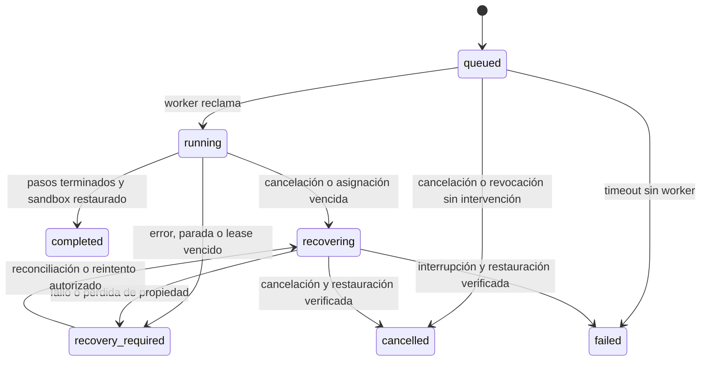

# Entrega 02 — Motor persistente y ensayo dry_run

Fecha: 29 de septiembre de 2026.

Estado: implementación del motor SQLite y recorrido de ensayo integrada y verificada localmente. **No es aceptación de una campaña real ni del gate G2 completo.** Se continuó sobre la entrega 01 y los archivos de la sesión interrumpida, conservando el resto del trabajo del repositorio.

## Resultado y alcance

En `Diagnóstico → Laboratorio 5G` (`/laboratory`), el docente puede asignar una práctica con límites y revocarla. El propietario de un plan puede iniciar un ensayo autorizado, seguir sus estados y diario, solicitar cancelación y reintentar una recuperación fallida. El estado sobrevive a la recarga del navegador y a la sustitución del worker.

El único adaptador del worker sigue siendo `SandboxAdapter`: cambia y restaura un valor en `lab_sandbox`, dentro de la misma transacción que verifica su propiedad. No importa transportes de SSH, MML, CHF ni operaciones de Core. La duración de medición del descriptor no se representa mediante esperas de red: el worker recorre pasos simulados.

Todas las respuestas de ejecución declaran `source=dry_run`, `network_measurements=false`, `metrics=null`, `validity_status=not_applicable` y `hypothesis_outcome=not_evaluated`. Completar un ensayo significa haber comprobado el flujo y la restauración del sandbox. No demuestra QoE, enforcement, aislamiento de slice ni apoyo a la hipótesis.

## Persistencia y autorización

- Migración aditiva SQLite v1 → v2: asignaciones, ejecuciones, leases, diario y sandbox. Conserva experimentos, revisiones, planes, hashes, claves de idempotencia y auditoría anterior.
- Prueba desde un fixture SQL v1 sin tablas v2, con datos de diseño y comparación completa antes/después. Incluye reapertura, idempotencia anterior, foreign keys e inmutabilidad. Una versión futura se rechaza.
- Prueba de inicialización concurrente del almacén vacío para API/worker/watchdog.
- Asignaciones creadas por docente/admin para un usuario activo resuelto en EMS. Un alumno necesita testbed. Un docente con testbed no asigna fuera de él.
- Límites por asignación: aliases observado/competidor diferentes, número de ensayos por plan, Mbps, presupuesto declarado de tráfico/captura por plan, vigencia y número de ejecuciones.
- Los presupuestos son límites de diseño; no acreditan control de bytes reales ni cuota CHF. La creación del ensayo consume una ejecución, incluso si falla o se cancela. No hay devolución automática.
- Inicio, consumo de asignación y reserva se confirman en una transacción. Repetir la misma clave devuelve la creación original; otra clave no crea una segunda ejecución del mismo plan. Para repetir, se crea un nuevo plan de la revisión.
- Exclusión por `dry-run:<testbed>`. No bloquea herramientas operativas del EMS ni constituye reserva del Core.
- Borradores y ejecuciones siguen siendo privados por propietario/testbed. Ser docente no otorga acceso a diseños ajenos. Solo el otorgante autorizado revoca su asignación.
- Proyección pública explícita para ejecuciones; no devuelve token, worker ni checkpoint. Aún no hay incidentes ocultos ni expedientes IA: no se declara resuelta su política futura de ground truth.

La base sigue siendo `laboratory.db` junto a `EMS_DATABASE_PATH`, salvo `EMS_LABORATORY_DATABASE_PATH`. API y ambos procesos deben compartir exactamente esa base local; no se admite la misma ruta que EMS. No alojarla en un filesystem remoto.

## Propiedad, diario y recuperación

El lease dura 30 segundos. El worker renueva antes de cada paso; el adaptador vuelve a verificar token, expiración, cancelación y vigencia de asignación dentro de la transacción que produce el efecto. Revocar una asignación cancela sus trabajos activos y libera inmediatamente los que nunca fueron reclamados.



El diario `lab_journal` es append-only mediante triggers. Registra intención antes del efecto y resultado después. Un intento sin resultado impide repetir automáticamente el paso, incluso si el mismo worker vuelve a procesar la ejecución; se pasa a recuperación. En el sandbox, repetir la compensación `restore` es seguro porque vuelve a escribir el checkpoint del recurso reservado. Esa propiedad no se atribuye a futuras compensaciones remotas.

Al vencer el lease de una ejecución reclamada se rota el token y se mantiene la reserva. Un worker antiguo no puede renovar, actuar, añadir un resultado ni finalizar con el token anterior. El watchdog independiente puede reclamar y recuperar el sandbox; no reclama campañas en cola.

Antes de liberar la reserva se verifica que el recurso existe y coincide con el checkpoint. Si la recuperación falla, queda `recovery_required` con `error_code=recovery_failed`; el worker/watchdog no la repite automáticamente. El propietario solicita `/recover` para habilitar un nuevo intento. Si el recurso fue eliminado, el reintento puede volver a fallar: no se inventa una restauración satisfactoria.

Los tests cubren cancelación/revocación entre heartbeat y efecto, expiración contra heartbeat/cancelación, dos recuperadores, muerte después del efecto sin resultado, rechazo del propietario antiguo y fallo de recuperación. También ejecutan procesos Python reales para parada cooperativa, muerte abrupta y recuperación por otro proceso. Esto acredita fencing del sandbox SQLite, **no fencing remoto, corte de tráfico ni recuperación del 5G Core**.

## API incorporada

Prefijo `/api/v1/laboratory`; todas las rutas requieren autenticación EMS.

| Ruta | Contrato |
|---|---|
| GET `/assignments` | Asignaciones recibidas y otorgadas dentro del ámbito autorizado |
| POST `/assignments` | Docente/admin; `Idempotency-Key`; solo `mode=dry_run` |
| POST `/assignments/{id}/revoke` | Otorgante autorizado; revocación repetible |
| POST `/campaigns/{id}/start` | Propietario; `assignment_id`, `mode=dry_run`, `Idempotency-Key`; 202 |
| GET `/campaigns/{id}/executions` | Ejecución del plan privado |
| GET `/executions/{id}` | Estado público actual |
| GET `/executions/{id}/events?after=N` | Hasta 200 eventos, ordenados por ID; cursor exclusivo |
| POST `/executions/{id}/cancel` | Solicitud persistente; no equivale a restauración terminada |
| POST `/executions/{id}/recover` | Rehabilita recuperación pendiente; no libera recursos por sí sola |

Los schemas son la fuente de verdad de límites y campos. `mode=remote` continúa rechazado con 422. Un replay de inicio puede devolver el estado original de creación: consultar GET para el estado actual.

## Arranque y parada

Desde `backend`, con el mismo entorno de la API:

```powershell
.\.venv\Scripts\python.exe -m app.laboratory.worker
.\.venv\Scripts\python.exe -m app.laboratory.worker --watchdog-only
```

Para procesar lo disponible y salir:

```powershell
.\.venv\Scripts\python.exe -m app.laboratory.worker --once
.\.venv\Scripts\python.exe -m app.laboratory.worker --watchdog-only --once
```

`--once` termina al no encontrar trabajo reclamable; no certifica que no haya reservas bloqueadas ni trabajos que otro proceso esté atendiendo. El estado de ejecución y diario son la referencia.

- `run_ems.ps1`: inicia API, frontend, worker y watchdog ocultos. Conserva logs separados en `.work/ems-<id>/`. Usa señales de parada por archivo único para worker/watchdog; drena recuperación antes del cierre. Detiene los árboles de procesos API/frontend iniciados por esa invocación.
- `run_ems.sh`: añade los dos procesos y limpieza por señal/salida; deja recuperación disponible durante la parada del worker.
- `docker-compose.yml`: dos servicios adicionales, misma base en `ems-data`, reinicio `unless-stopped` y período de parada de 15 segundos. No publican puertos.
- Una muerte forzada o cierre simultáneo de todo el entorno puede dejar recuperación pendiente hasta el siguiente arranque. La reserva permanece; no se afirma disponibilidad segura durante esa interrupción.

Se validaron sintaxis PowerShell/Bash y configuración Compose. Se probaron además arranque oculto y parada cooperativa de ambos procesos Windows con una base aislada. No se ejecutó el launcher completo sobre los servicios del usuario ni se desplegó Compose/Linux en vivo.

## Recorrido de uso

1. Docente abre «Asignar práctica», indica usuario existente, aliases y límites; guarda la asignación.
2. Alumno crea o abre su experimento y guarda/valida la revisión. Los aliases y presupuestos deben caber en su asignación.
3. Crea un plan, selecciona la asignación vigente y pulsa «Iniciar ensayo dry_run».
4. Observa estado, pasos y diario. Puede cargar páginas adicionales de eventos y reabrir el experimento tras recargar.
5. «Cancelar ensayo» solicita compensación. Mientras no se compruebe restauración, la reserva permanece.
6. Si falla la recuperación, la pantalla muestra recurso bloqueado y ofrece reintento explícito. El ensayo no se interpreta como resultado científico.

## Avance posterior: preflight real de solo lectura

`backend/app/laboratory/preflight.py` incorpora un prototipo separado de observación de servicios. Reutiliza `RemoteExecutionAdapter.service_statuses` con una lista fija: AMF, los dos SMF, PCF, NSSF y NWDAF. No acepta shell, MML, unidades ni destinos suministrados por alumno/IA. La factoría rechaza modo simulado/local; no utiliza fallback con medidas ficticias.

No está conectado a API, campañas ni arranque. **No se ejecutó contra el Core en esta entrega.** Sus pruebas utilizan lectores controlados. Aunque todos los servicios se observen activos, devuelve `execution_ready=false` y mantiene pendientes identidad de sesiones, ruta, calibración, presupuesto CHF completo, política inicial, medición, relojes, fencing y recuperación remotos. El timeout de observación no garantiza detener el hilo SSH existente; esa limitación debe resolverse antes de instrumentación viva con plazos estrictos.

La revisión de `infra/nwdaf_qoe_campaign.py` confirmó creación de rutas, servicios auxiliares y timers. No se envolvió su `main()` como acción del motor. Falta extraer operaciones estructuradas con propiedad y verificaciones, conservando la CLI existente.

## Verificación de software

Resultados finales. No confundir pruebas de software con medidas de red.

| Comprobación | Resultado |
|---|---|
| Backend de laboratorio (diseño, runtime y preflight) | 58 aprobadas: 22 de diseño, 31 de runtime, 5 de preflight |
| Chromium/Vitest del laboratorio | 6 aprobadas |
| TypeScript `pnpm exec tsc -b` | Aprobado |
| ESLint de laboratorio y ruta | Aprobado |
| `pnpm run build` | Aprobado; advertencia existente de chunks >500 kB |
| PowerShell parser, Bash `-n`, `docker compose config --quiet` | Aprobados |
| Worker/watchdog Windows ocultos, base aislada | Arranque y parada aprobados |
| Suite global backend | 176 aprobadas, 2 fallidas en trazas preexistentes; 42,15 s |

Comandos reproducibles:

```text
.\.venv\Scripts\python.exe -m pytest tests/test_laboratory.py tests/test_laboratory_runtime.py tests/test_laboratory_preflight.py -q
.\.venv\Scripts\python.exe -m pytest -q --tb=short
pnpm exec vitest run src/features/laboratory/index.test.tsx --browser.headless
pnpm exec eslint src/features/laboratory src/routes/_authenticated/laboratory/index.tsx
pnpm exec tsc -b
pnpm run build
```

Ejecutar pytest desde `backend` usando `.\.venv\Scripts\python.exe`; los comandos pnpm desde `frontend`. Chromium usa API simulada para verificar el comportamiento de la interfaz; no es una prueba de navegador contra el backend desplegado. Las pruebas de procesos sí usan worker, SQLite y watchdog reales en almacenamiento temporal.

Persisten las discrepancias ajenas al laboratorio:

1. `test_node_trace_catalog_exposes_supported_csp_nodes_without_bpf_filters`: expectativa sin `smf2`, ya presente en catálogo.
2. `test_dual_smf_trace_attribution`: espera `127.0.0.15 → SMF-02`, pero el mapeo conserva `BSF`.

No se modificaron estas atribuciones sin inventario vivo.

## Archivos y estado frente al plan

- Backend: `migrations.py`, `runtime.py`, `adapters.py`, `worker.py`, `storage.py`, repositorio, schemas, planner, capacidades y router del laboratorio.
- Frontend: pantalla existente, `runtime.tsx`, `requests.ts` y pruebas Chromium.
- Integración: lifespan API, scripts de arranque, Compose y comentario del almacén en `.env.example`.
- Tests: `test_laboratory.py`, `test_laboratory_runtime.py`, `test_laboratory_preflight.py`, fixture SQL v1.
- Inicio del siguiente bloque: `preflight.py`, sin integración con ejecución.
- Huellas de fuentes: `ENTREGA_02_MANIFEST.json`, generado sobre los archivos finales. Los archivos compartidos incluyen trabajo previo; el manifiesto identifica contenido, no autoría ni despliegue.

F1 y F4 avanzan en asignaciones, estados y controles. F2-01 queda implementada; reserva, diario, cancelación y recuperación están verificadas exclusivamente en sandbox. G0/G1/G2/G4 siguen sin cierre para ejecución real. No hay nuevos resultados de red, artefactos PCAP ni instalación de modelos.

Siguiente trabajo: vincular aliases autorizados a sesiones vivas y recursos compartidos; completar preflight y presupuesto por UE, preparación y cierre; diseñar guard/watchdog remoto y comprobar compensaciones; extraer una intervención acotada de la campaña existente; verificarla con recepción independiente antes de habilitar ejecución real. El consumo CHF permanece como hecho contable, nunca como estado restaurable.
